# CSS Flexbox

The flexible box layout module, makes it easier to design flexible responsive layout structures.

Flexbox layouts are most appropriate to components of an application or small-scale layouts. For large scale layouts use [Grid](<./07b Grid.md>).

[CSS Tricks](https://css-tricks.com/snippets/css/a-guide-to-flexbox/) has a great article on flexbox.

## The Setup

Below is the html structure we will be using for our examples.


<details>
<summary>Starting CSS</summary>
<br>
<pre>
<code>
/* These styles are only used for demonstration and not needed for flex. */
.parent {
border-radius: 8px;
background-color: hsl(217, 90%, 61%);
padding: 0.5rem;
}
<br/>
.child {
border-radius: 8px;
background-color: hsl(217, 100%, 92%);
display: flex;
justify-content: center;
align-items: center;
font-size: 4rem;
color: hsl(217, 100%, 12%);
margin: 0.5rem;
padding: 0.5rem 2rem;
}
</code>

</pre>
</details>

```html
<main class="parent">
  <div class="child">1</div>
  <div class="child">2</div>
  <div class="child">3</div>
  <div class="child">4</div>
  <div class="child">5</div>
  <div class="child">6</div>
</main>
```

## display flex

Let's start by adding the `display: flex;` property to our parent and see what happens.


```css
.parent {
  display: flex;
}
```

## flex-direction

Notice how the children are now next to each other, almost like a `row`. And that is because by add `display: flex;` we are also applying a `flex-direction: row;` by default.

What happens if we change the default `row` to a column?


```css
.parent {
  display: flex;
  flex-direction: column;
}
```

Now the children are back to a column layout.

## flex-wrap

Let's take a look at what happens when our content is too large to fit in a row.
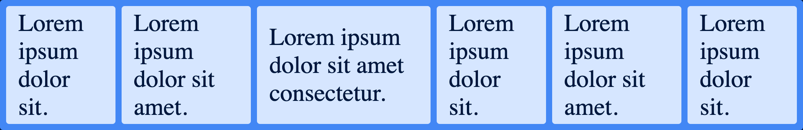

```html
<main class="parent">
  <div class="child">Lorem ipsum dolor sit.</div>
  <div class="child">Lorem ipsum dolor sit amet.</div>
  <div class="child">Lorem ipsum dolor sit amet consectetur.</div>
  <div class="child">Lorem ipsum dolor sit.</div>
  <div class="child">Lorem ipsum dolor sit amet.</div>
  <div class="child">Lorem ipsum dolor sit.</div>
</main>
```

```css
.parent {
  display: flex;
  flex-direction: row;
}
```

Looks like our children are being squished, only being held open by the largest word in their content. We can fix this by applying the `flex-wrap: wrap;` property
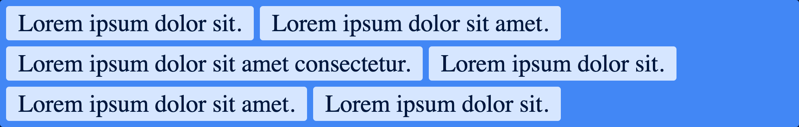

```css
.parent {
  display: flex;
  flex-direction: row;
  flex-wrap: wrap;
}
```

## justify-content

`justify-content` can be used to position the children within the parent. `justify-content` works on the main axis, meaning `flex-direction: row;` would act on the horizontal axis, whereas `flex-direction: column;` would act on the vertical axis. By default `justify-content: flex-start;` is being applied. What happens if we change `flex-start` to `flex-end`? We get this:
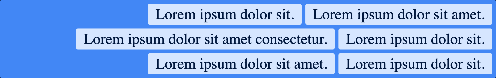

```css
.parent {
  display: flex;
  flex-direction: row;
  flex-wrap: wrap;
  justify-content: flex-end;
}
```

Flex-start will position children at the start of the parent, flex-end will position them at the end of the parent.

We can also center our elements by setting the `justify-content: center;` property.
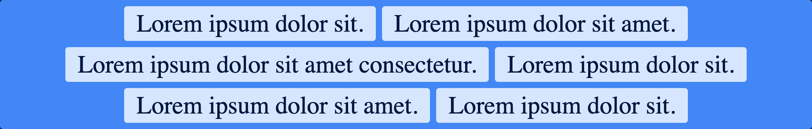

```css
.parent {
  display: flex;
  flex-direction: row;
  flex-wrap: wrap;
  justify-content: center;
}
```

Let's also take a look at `space-between`, `space-evenly`, and `space-around`.

Space-between will position children a the edges with equal spacing between elements.
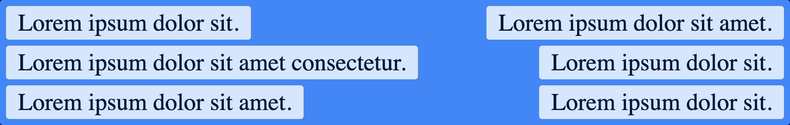

```css
.parent {
  display: flex;
  flex-direction: row;
  flex-wrap: wrap;
  justify-content: space-between;
}
```

Space-evenly will apply even spacing around all children.
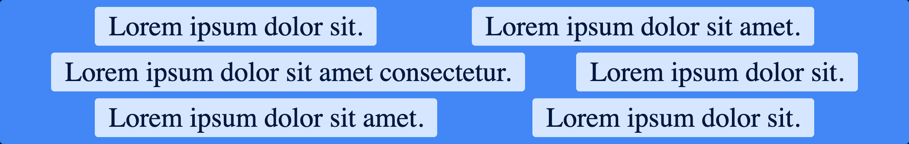

```css
.parent {
  display: flex;
  flex-direction: row;
  flex-wrap: wrap;
  justify-content: space-evenly;
}
```

Space-around will apply spacing on the edges with equal spacing between children.
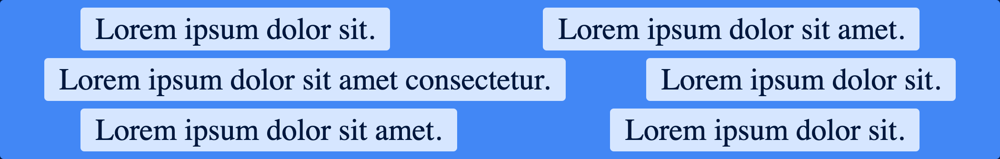

```css
.parent {
  display: flex;
  flex-direction: row;
  flex-wrap: wrap;
  justify-content: space-around;
}
```

## align-items

Next let's take a look at `align-items`. `align-items` behaves similarly to `justify-content` with the exception that it applies to the cross axis. `align-items` can take a number of properties, some of them are `stretch`, `center`, `flex-start` and `flex-end`. `stretch` is the default value and if we add a bit of height to our parent we can see its effect.
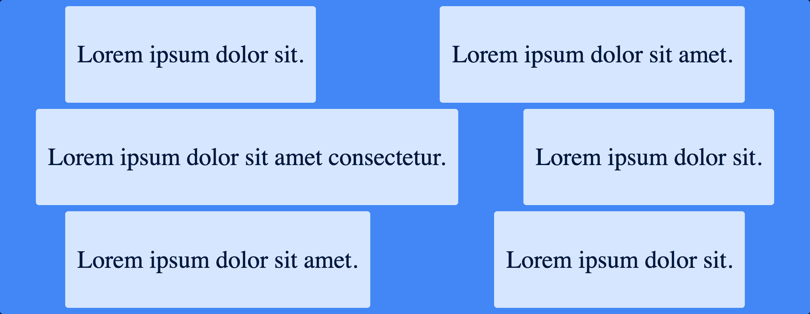

```css
.parent {
  display: flex;
  flex-direction: row;
  flex-wrap: wrap;
  justify-content: space-around;
  align-items: stretch;
}
```

`align-items: center;` will align the children vertically to the center. This is the easiest way to center elements vertically.
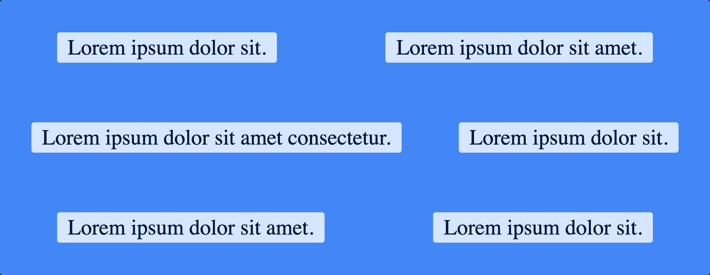

```css
.parent {
  display: flex;
  flex-direction: row;
  flex-wrap: wrap;
  justify-content: space-around;
  align-items: center;
}
```

`align-items: flex-start;` will align children to the start of the parent.
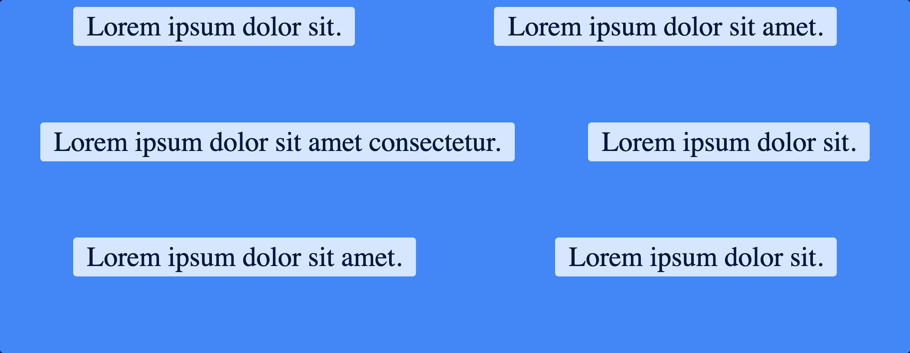

```css
.parent {
  display: flex;
  flex-direction: row;
  flex-wrap: wrap;
  justify-content: space-around;
  align-items: flex-start;
}
```

`align-items: flex-end;` will align children to the end of the parent.
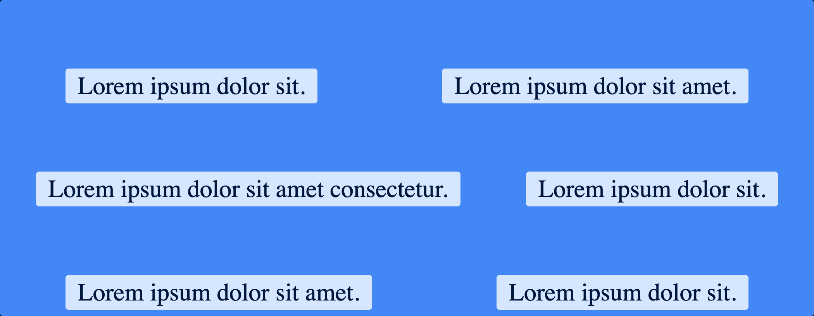

```css
.parent {
  display: flex;
  flex-direction: row;
  flex-wrap: wrap;
  justify-content: space-around;
  align-items: flex-end;
}
```
